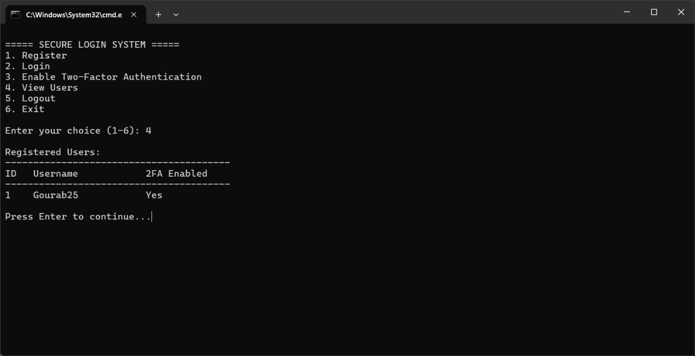

# 🔐 Secure Login System (Python + SQLite)

A **secure and minimal CLI-based login system** built with Python and SQLite. It features **password hashing**, **TOTP-based Two-Factor Authentication (2FA)**, and a clean text-based UI — ideal for learning or simple authentication prototypes.

---

## 🚀 Features

- 🔐 Secure password hashing with SHA-256 and unique salt
- 🔑 Two-Factor Authentication (2FA) using TOTP (Time-based One-Time Passwords)
- 🧱 SQLite database for user data storage
- 📂 Persistent login system with registration, login, logout
- 🧾 Displays user details (ID, username, 2FA status)
- 💡 Clean CLI interface for terminal use

---

## 📸 Demo

> Below is a screenshot showing a user with 2FA enabled:



---

You’re seeing formatting issues in GitHub's dark theme because:

* You're putting code block markers like ` ```bash ` inside a block that's already treated as code.
* You’re using `>` (block quote) instead of proper Markdown structure for lists and sections.

Here’s a **clean and properly formatted** version of the sections you can **copy-paste into your README.md** directly:

---

### 🛠️ How to Use

### 1. Clone the Repository

```bash
git clone https://github.com/gourab-0/secure-login-system.git
cd secure-login-system
````

### 2. Run the Script

```bash
python secure_login.py
```

### 3. Follow the Menu

```
1. Register
2. Login
3. Enable Two-Factor Authentication
4. View Users
5. Logout
6. Exit
```
---

## 🔐 How 2FA Works

- The system generates a **Base32 secret key**
- Every 30 seconds, a new 6-digit TOTP code is calculated
- The code can be entered manually or scanned using apps like:
  - Google Authenticator
  - Authy
  - Microsoft Authenticator
---

## ✅ Requirements

- Python 3.x
- No third-party libraries — pure Python standard modules only!
